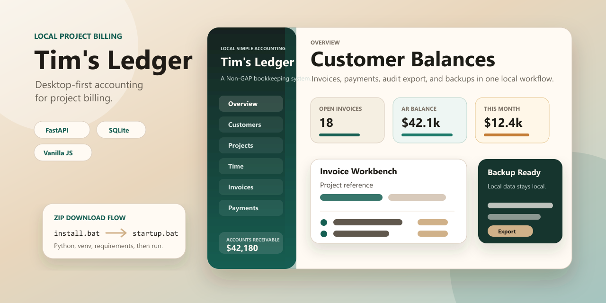

# Tim's Ledger



Tim's Ledger is a local, desktop-first accounting workflow for project billing. It uses a FastAPI backend, a vanilla HTML/JavaScript frontend, SQLite persistence, and generated HTML invoice documents.

The app is meant to replace a spreadsheet-driven workflow, not become a full accounting platform. It focuses on customers, projects, time, expenses, invoices, payments, accounts receivable, audit export, and backup/restore.

## Documentation

  - [Product requirements](docs/tims_ledger_prd.md)
  - [Core workflows](docs/workflows.md)
  - [API reference](docs/API%20Reference.md)

## Tech Stack

  - Backend: FastAPI and SQLite
  - Frontend: static HTML pages with vanilla JavaScript controllers
  - Runtime data: `app-data/`
  - Migrations: ordered SQL files in `migrations/`

## Project Layout

```text
backend/app/       FastAPI routes, domain modules, SQLite helpers, reporting, backups
frontend/html/     One desktop-oriented page per screen
frontend/js/       One vanilla JavaScript controller per screen plus shared utilities
migrations/        Startup-applied SQLite migrations
docs/              Product, workflow, and API documentation
app-data/          Local runtime data, database, invoices, and backups; gitignored
```

## First-Time Install

After downloading and unzipping the repository, run the installer from the repo root:

```powershell
.\install.bat
```

`install.bat` checks for Python 3.10 or newer, tries to install Python 3.13 with `winget` if Python is missing, creates `.venv`, and installs `backend/requirements.txt` into that virtual environment. It does not install packages globally.

## Running Locally

Use the project virtual environment. Do not install packages globally. If `.venv` is missing, run `.\install.bat` first.

```powershell
if ($env:VIRTUAL_ENV) { $env:VIRTUAL_ENV } else { . .\.venv\Scripts\Activate.ps1 }
```

Start the application with the repo startup script:

```powershell
.\startup.bat
```

By default, the app runs at:

```text
http://127.0.0.1:8004/
```

`startup.bat` starts `uvicorn`, waits for `/api/health`, and opens the browser unless `TIMS_LEDGER_SKIP_BROWSER=1` is set.

## Configuration

The backend reads these environment variables:

  - `TIMS_LEDGER_DATA_DIR`: Runtime data directory. Defaults to `app-data/`.
  - `TIMS_LEDGER_DB_PATH`: SQLite database path. Defaults to `app-data/tims-ledger.db`.
  - `TIMS_LEDGER_MIGRATIONS_DIR`: Migration directory. Defaults to `migrations/`.
  - `TIMS_LEDGER_SKIP_STARTUP_MIGRATIONS`: Set to `1` to skip applying pending migrations at startup.

The startup script also reads:

  - `TIMS_LEDGER_HOST`: Defaults to `127.0.0.1`.
  - `TIMS_LEDGER_PORT`: Defaults to `8004`.
  - `TIMS_LEDGER_WINDOW_TITLE`: Backend terminal title.
  - `TIMS_LEDGER_FOREGROUND`: Set to `1` to run uvicorn in the current terminal.
  - `TIMS_LEDGER_SKIP_BROWSER`: Set to `1` to avoid opening the browser.

## Data Safety

`app-data/tims-ledger.db` is the source-of-truth database. `app-data/invoices/` stores generated invoice HTML documents. Both are local production data and are gitignored.

Use the application backup and restore workflow instead of manually replacing the database. Normal backups are written to `app-data/backups/` as `Tims-Ledger-Backup-{date-timestamp}.zip`. Restore safety backups are written under `app-data/backups/safety/` and are not listed as normal restore choices.

The XLSX export is for audit and readability. It is not the backup format.

## Verification

There is currently no automated test suite. For Python changes, run the lightweight syntax check:

```powershell
. .\.venv\Scripts\Activate.ps1
python -m py_compile (Get-ChildItem backend\app -Filter *.py | ForEach-Object { $_.FullName })
```

For frontend and workflow changes, start the app with `.\startup.bat` and verify the affected screen manually.

## Current Product Rules

  - Time billability comes from the selected project rate. A rate of `0` is non-billable.
  - Fixed-fee and materials-order billing are represented through custom project rates and unit entries in time.
  - Expense categories are limited to `Materials`, `Lodging`, `Airfare`, `Mileage`, `Perdiem`, `Rental Car`, `Gas`, `Parking`, `Tolls`, `Meals`, `Entertainment`, `Gifts`, `Freight`, and `Misc.`.
  - Invoice source-row checkbox changes remain browser-local until Save/Print.
  - Printed invoice project references read `{project number} - {project description}`.
  - PO number is not part of the active invoice UI.
  - Payment drafts stay browser-local until Save Payment. Payment references are optional, zero-dollar drafts are allowed, and negative payments support credits or corrections.
