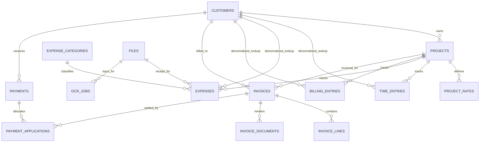

# Workflow-Aligned Database Schema

## Purpose

This document defines a target database schema for Windsage Ledger based on the workflow described in [docs/architecture/workflows.md](./workflows.md).

The workflow document is the only approved source of truth for behavior. This schema document is an interpretation layer only. If this document and the workflow ever disagree, the workflow wins and this document must be updated.

The goal is to formalize the data model around the actual accounting workflow:

  - customers are entered once and reused
  - projects belong to one customer and own their billing rules
  - time, expenses, and controlled non-hourly billing items are source records
  - invoices are built from source records and selected source rows are linked immediately as checkboxes are toggled
  - payments and payment applications remain separate
  - OCR data remains separate from approved accounting data

This schema is intentionally close to the existing SQLAlchemy model, but it adds the missing structures needed to support the workflow cleanly.

## Design Principles

1. Keep separate source-record tables.

Time entries, expenses, and controlled non-hourly billing items have materially different attributes. A single generic source-record table would make the database harder to understand and validate.

1. Let invoice editing link source rows explicitly.

Invoice contents should live in `invoice_lines`, but selecting a source row into an invoice should also assign that source row to the invoice immediately. Removing a row from the invoice should clear that assignment.

In the database, this assignment should be stored as `invoice_id`, not duplicated invoice-number text. The invoice number remains available through the linked invoice record. Issuing the invoice should not change source-row linkage; it should only publish or refresh the invoice register entry and current PDF.

1. Store project billing rules explicitly.

The workflow requires built-in rates (`ST`, `OT`, `TT`, `HD`) plus project-specific custom rates. Those rules belong in their own table instead of being inferred from freeform strings.

## Entity Relationship Overview

## Enumerations

These should remain application enums backed by `TEXT` columns in SQLite.

| Enum | Values |
| --- | --- |
| `project_status` | `active`, `completed`, `inactive` |
| `contract_type` | `time_and_materials`, `fixed_fee`, `hybrid` |
| `pricing_method` | `multiplier`, `fixed_unit_price`, `manual_amount` |
| `billing_status` | `unbilled`, `assigned`, `non_billable`, `voided` |
| `invoice_status` | `draft`, `issued`, `partially_paid`, `paid`, `overdue`, `void` |
| `payment_type` | `customer_payment`, `advance`, `refund`, `credit_adjustment` |
| `source_type` | `time_entry`, `expense`, `billing_entry` |
| `ocr_job_status` | `pending`, `processing`, `needs_review`, `approved`, `failed` |
| `approval_status` | `pending`, `approved`, `rejected`, `voided` |

## Core Tables

### `customers`

Customer master data used by projects, invoices, payments, and customer balance reporting.

| Column | Type | Notes |
| --- | --- | --- |
| `id` | integer PK | |
| `name` | string(200) not null | workflow `customer_name` |
| `billing_contact_name` | string(200) null | workflow `customer_contact` |
| `billing_email` | string(255) null | workflow `customer_email` |
| `phone` | string(50) null | workflow `customer_phone` |
| `billing_address_line1` | string(255) null | workflow `customer_street_address` |
| `billing_address_line2` | string(255) null | optional second address line |
| `billing_city` | string(120) null | workflow `customer_city` |
| `billing_state` | string(50) null | workflow `customer_state` |
| `billing_postal_code` | string(30) null | workflow `customer_zip` |
| `default_terms` | string(100) not null default `Due on receipt` | |
| `active` | boolean not null default `true` | |
| `notes` | text null | |
| `created_at` | datetime not null | |
| `updated_at` | datetime not null | |

Notes:

  - Address and contact fields may remain nullable at the table level, but invoice issuance should validate that the billing profile is complete enough to render an invoice.
  - Customer `name` should remain indexed, but not globally unique.

### `projects`

Project master data and top-level billing behavior.

| Column | Type | Notes |
| --- | --- | --- |
| `id` | integer PK | |
| `customer_id` | FK -> `customers.id` not null | |
| `project_number` | string(80) not null unique | workflow `project_number` |
| `name` | string(200) null | optional display title |
| `description` | text not null | workflow `project_description` |
| `contract_type` | string(40) not null | `time_and_materials`, `fixed_fee`, `hybrid` |
| `status` | string(40) not null default `active` | |
| `default_hourly_rate` | numeric(12,2) not null default `0.00` | workflow `project_default_rate` |
| `fixed_fee_amount` | numeric(12,2) null | workflow `project_fixed_fee` |
| `created_at` | datetime not null | |
| `updated_at` | datetime not null | |

Constraints and rules:

  - Unique index on `project_number`.
  - `default_hourly_rate >= 0`.
  - `fixed_fee_amount >= 0` when present.
  - A fixed-fee project may validly have `default_hourly_rate = 0.00`.

### `project_rates`

Explicit rate catalog for each project. This is the missing structure required by the workflow.

| Column | Type | Notes |
| --- | --- | --- |
| `id` | integer PK | |
| `project_id` | FK -> `projects.id` not null | |
| `code` | string(20) not null | `ST`, `OT`, `TT`, `HD`, or custom code |
| `label` | string(120) not null | user-facing label |
| `pricing_method` | string(40) not null | `multiplier`, `fixed_unit_price`, `manual_amount` |
| `multiplier` | numeric(8,4) null | used for `ST`, `OT`, `TT` |
| `default_unit_price` | numeric(12,2) null | used for fixed or explicit rates |
| `unit_label` | string(40) not null default `hour` | `hour`, `each`, `lot`, etc. |
| `billable_default` | boolean not null default `true` | |
| `system_defined` | boolean not null default `false` | built-in vs custom |
| `active` | boolean not null default `true` | |
| `sort_order` | integer not null default `0` | |
| `created_at` | datetime not null | |
| `updated_at` | datetime not null | |

Constraints and rules:

  - Unique constraint on (`project_id`, `code`).
  - Seed four rows on project creation:
    - `ST` with `pricing_method = multiplier`, `multiplier = 1.0`
    - `OT` with `pricing_method = multiplier`, `multiplier = 1.5`
    - `TT` with `pricing_method = multiplier`, `multiplier = 0.5`
    - `HD` with `pricing_method = manual_amount`, `unit_label = each`
  - Custom project rates are additional rows in this table.

### `expense_categories`

Retain the current category table with accounting mapping fields.

| Column | Type | Notes |
| --- | --- | --- |
| `id` | integer PK | |
| `name` | string(120) not null unique | |
| `default_billable` | boolean not null default `true` | |
| `default_reimbursable` | boolean not null default `true` | |
| `tax_category` | string(120) null | |
| `revenue_category` | string(120) null | |
| `expense_category` | string(120) null | |
| `created_at` | datetime not null | |

## Source Record Tables

### `time_entries`

Time-based source records eligible for invoicing.

| Column | Type | Notes |
| --- | --- | --- |
| `id` | integer PK | |
| `customer_id` | FK -> `customers.id` not null | denormalized from project for query convenience |
| `project_id` | FK -> `projects.id` not null | |
| `entry_date` | date not null | |
| `description` | text not null | |
| `hours` | numeric(8,2) not null | must be `> 0` |
| `project_rate_id` | FK -> `project_rates.id` not null | chosen rate definition |
| `rate_code_snapshot` | string(20) not null | preserves historical display value |
| `rate_snapshot` | numeric(12,2) not null | resolved unit price at entry time |
| `billable` | boolean not null default `true` | |
| `billing_status` | string(40) not null default `unbilled` | |
| `invoice_id` | FK -> `invoices.id` null | set when selected into an invoice and cleared when unselected |
| `created_at` | datetime not null | |
| `updated_at` | datetime not null | |

Rules:

  - `customer_id` must match the linked project's customer.
  - `billing_status = non_billable` is the canonical state for hours retained for tracking but excluded from invoice eligibility.
  - `billing_status = assigned` means the row is currently linked to an invoice, whether or not that invoice has already been issued.
  - `invoice_id` is set as soon as the user selects the row into an invoice and is cleared if the row is removed.

### `expenses`

Expense source records eligible for invoicing.

| Column | Type | Notes |
| --- | --- | --- |
| `id` | integer PK | |
| `customer_id` | FK -> `customers.id` not null | denormalized from project for query convenience |
| `project_id` | FK -> `projects.id` not null | |
| `expense_date` | date not null | |
| `vendor` | string(200) null | workflow expense vendor |
| `description` | text not null | |
| `qty` | numeric(10,2) not null default `1.00` | must be `> 0` |
| `unit_cost` | numeric(12,2) not null | must be `>= 0` |
| `total` | numeric(12,2) not null | typically `qty * unit_cost` |
| `category_id` | FK -> `expense_categories.id` null | |
| `billable` | boolean not null default `true` | |
| `reimbursable` | boolean not null default `true` | |
| `paid_by` | string(120) null | |
| `payment_method` | string(120) null | |
| `receipt_file_id` | FK -> `files.id` null | |
| `include_receipt_with_invoice` | boolean not null default `false` | controls PDF append behavior |
| `billing_status` | string(40) not null default `unbilled` | |
| `invoice_id` | FK -> `invoices.id` null | set when selected into an invoice and cleared when unselected |
| `created_at` | datetime not null | |
| `updated_at` | datetime not null | |

Rules:

  - `customer_id` must match the linked project's customer.
  - Non-billable expenses remain in the project cost history but are excluded from invoice eligibility.
  - `billing_status = assigned` means the row is currently linked to an invoice, whether or not that invoice has already been issued.
  - `invoice_id` is set as soon as the user selects the row into an invoice and is cleared if the row is removed.
  - `total` should be computed in service logic and verified before persistence.

### `billing_entries`

Controlled non-hourly billing records. This is the second major missing structure in the current schema.

Use this table for fixed-fee lines, lump-sum lines, per-each billing, and approved `HD` style lines that should behave like source records before invoicing.

| Column | Type | Notes |
| --- | --- | --- |
| `id` | integer PK | |
| `customer_id` | FK -> `customers.id` not null | denormalized from project for query convenience |
| `project_id` | FK -> `projects.id` not null | |
| `billing_date` | date not null | |
| `project_rate_id` | FK -> `project_rates.id` not null | often `HD` or custom non-hourly rate |
| `description` | text not null | |
| `qty` | numeric(10,2) not null default `1.00` | |
| `unit_price` | numeric(12,2) not null | |
| `amount` | numeric(12,2) not null | |
| `approval_status` | string(40) not null default `pending` | must be `approved` before invoicing |
| `billing_status` | string(40) not null default `unbilled` | |
| `invoice_id` | FK -> `invoices.id` null | set when selected into an invoice and cleared when unselected |
| `created_at` | datetime not null | |
| `updated_at` | datetime not null | |

Rules:

  - `amount` should equal `qty * unit_price`.
  - Only rows with `approval_status = approved` are invoice candidates.
  - `billing_status = assigned` means the row is currently linked to an invoice, whether or not that invoice has already been issued.
  - `invoice_id` is set as soon as the user selects the row into an invoice and is cleared if the row is removed.
  - This table replaces the current need to inject non-hourly work directly into invoice lines.

## Invoice Tables

### `invoices`

One invoice belongs to one project and one customer.

| Column | Type | Notes |
| --- | --- | --- |
| `id` | integer PK | |
| `invoice_number` | string(80) not null unique | workflow `invoice number` |
| `customer_id` | FK -> `customers.id` not null | denormalized for reporting and balance queries |
| `project_id` | FK -> `projects.id` not null | workflow requires invoice creation by project |
| `invoice_date` | date not null | |
| `due_date` | date null | |
| `issued_at` | datetime null | null until first issue; refreshed on reissue if desired |
| `status` | string(40) not null default `draft` | |
| `terms` | string(100) not null default `Due on receipt` | |
| `bill_to_name` | string(200) not null | customer snapshot |
| `bill_to_contact_name` | string(200) null | customer snapshot |
| `bill_to_email` | string(255) null | customer snapshot |
| `bill_to_phone` | string(50) null | customer snapshot |
| `bill_to_address_line1` | string(255) null | customer snapshot |
| `bill_to_address_line2` | string(255) null | customer snapshot |
| `bill_to_city` | string(120) null | customer snapshot |
| `bill_to_state` | string(50) null | customer snapshot |
| `bill_to_postal_code` | string(30) null | customer snapshot |
| `prior_balance_snapshot` | numeric(12,2) not null default `0.00` | shown separately from current charges |
| `unapplied_credit_snapshot` | numeric(12,2) not null default `0.00` | shown separately from current charges |
| `subtotal_labor` | numeric(12,2) not null default `0.00` | |
| `subtotal_expenses` | numeric(12,2) not null default `0.00` | |
| `subtotal_other` | numeric(12,2) not null default `0.00` | billing entries and other non-hourly items |
| `sales_tax` | numeric(12,2) not null default `0.00` | |
| `total` | numeric(12,2) not null default `0.00` | |
| `open_balance` | numeric(12,2) not null default `0.00` | |
| `issue_version` | integer not null default `0` | optional publish counter if reissue history is retained |
| `created_at` | datetime not null | |
| `updated_at` | datetime not null | |

Rules:

  - `customer_id` must match `projects.customer_id` for the linked project.
  - The invoice remains editable in both `draft` and `issued` states.
  - Selecting a source row into the invoice sets that row's `invoice_id` immediately and changes its `billing_status` to `assigned`.
  - Removing a source row from the invoice clears that row's `invoice_id` and returns it to `unbilled`.
  - On issue, the service must recalculate totals, ensure the invoice appears in the invoice listing, set or refresh `issued_at`, and generate or overwrite the current PDF.
  - Reissuing an already-issued invoice refreshes the same invoice record and current PDF rather than requiring a separate recall workflow.

### `invoice_lines`

Current invoice composition.

| Column | Type | Notes |
| --- | --- | --- |
| `id` | integer PK | |
| `invoice_id` | FK -> `invoices.id` not null | |
| `source_type` | string(40) null | `time_entry`, `expense`, `billing_entry`, or null for freeform adjustments |
| `source_id` | integer null | row id in source table when applicable |
| `description` | text not null | printable line description |
| `qty` | numeric(10,2) not null | |
| `unit_price` | numeric(12,2) not null | |
| `amount` | numeric(12,2) not null | |
| `line_group` | string(80) null | `labor`, `expense`, `other` |
| `sort_order` | integer not null default `0` | |

Rules:

  - `invoice_lines` are the authoritative printable composition records for the current invoice state.
  - For source-backed lines, `source_type` and `source_id` identify the selected source row.
  - Source-backed `invoice_lines` must stay consistent with the source row's `invoice_id` assignment.
  - A unique index on (`invoice_id`, `sort_order`) is recommended.

### `invoice_documents`

Tracks the rendered invoice file, with optional history if reissue versions are retained.

| Column | Type | Notes |
| --- | --- | --- |
| `id` | integer PK | |
| `invoice_id` | FK -> `invoices.id` not null | |
| `file_id` | FK -> `files.id` not null | rendered PDF or archive file |
| `issue_version` | integer not null | links document to a specific issue cycle |
| `document_type` | string(40) not null default `invoice_pdf` | |
| `is_current` | boolean not null default `true` | only one current document per invoice/document type |
| `created_at` | datetime not null | |

The current workflow only requires a current printable PDF per invoice. Historical versions are optional if they become useful later.

## Payment Tables

### `payments`

Cash receipts, advances, credits, and refunds.

| Column | Type | Notes |
| --- | --- | --- |
| `id` | integer PK | |
| `customer_id` | FK -> `customers.id` not null | |
| `payment_date` | date not null | |
| `deposit_date` | date null | |
| `payment_type` | string(40) not null | |
| `reference_no` | string(120) null | check number, ACH ref, etc. |
| `amount` | numeric(12,2) not null | signed value allowed for refunds/credits |
| `unapplied_amount` | numeric(12,2) not null | signed running remainder |
| `bank_account` | string(120) null | |
| `notes` | text null | |
| `created_at` | datetime not null | |
| `updated_at` | datetime not null | |

Rules:

  - Positive amounts represent incoming payments or credits available to apply.
  - Negative amounts may be used for customer refunds if that workflow is retained.
  - `unapplied_amount` must be kept transactionally in sync with `payment_applications`.

### `payment_applications`

Allocation of payment value to invoices.

| Column | Type | Notes |
| --- | --- | --- |
| `id` | integer PK | |
| `payment_id` | FK -> `payments.id` not null | |
| `invoice_id` | FK -> `invoices.id` not null | |
| `application_date` | date not null | |
| `amount_applied` | numeric(12,2) not null | |
| `notes` | text null | |
| `created_at` | datetime not null | |

Rules:

  - Applications may not overdraw the payment or overpay the invoice.
  - Invoice `open_balance` and payment `unapplied_amount` are derived state maintained transactionally by service logic.

## File and OCR Tables

### `files`

Retain the current generic file registry.

| Column | Type | Notes |
| --- | --- | --- |
| `id` | integer PK | |
| `file_type` | string(50) not null | receipt, invoice_pdf, import_file, export_file |
| `original_name` | string(255) not null | |
| `storage_path` | string(500) not null | |
| `mime_type` | string(100) null | |
| `sha256` | string(64) not null indexed | |
| `created_at` | datetime not null | |

### `ocr_jobs`

Retain the current OCR pipeline shape with raw extraction separate from approved accounting fields.

| Column | Type | Notes |
| --- | --- | --- |
| `id` | integer PK | |
| `file_id` | FK -> `files.id` not null | |
| `status` | string(40) not null | |
| `provider` | string(120) null | |
| `extracted_json` | JSON null | raw OCR output |
| `confidence` | numeric(5,4) null | |
| `reviewed_by` | string(120) null | |
| `reviewed_at` | datetime null | |
| `created_at` | datetime not null | |
| `updated_at` | datetime not null | |

`ocr_jobs` remains intentionally separate from `expenses`. Approval creates or updates an expense record, but the raw OCR record remains intact.

## Supporting Tables

### `audit_events`

Retain the current audit table for material state changes to invoices, payments, payment applications, billing entries, and OCR approvals.

### `app_settings`

Retain the current settings table for company identity, invoice numbering, default terms, tax settings, and rendering preferences.

## Recommended Indexes

In addition to primary and unique keys, the following indexes are important for workflow performance:

  - `customers(name)`
  - `projects(customer_id)`
  - `projects(project_number)` unique
  - `project_rates(project_id, active)`
  - `time_entries(project_id, billing_status, entry_date)`
  - `time_entries(customer_id, billing_status, entry_date)`
  - `expenses(project_id, billing_status, expense_date)`
  - `expenses(customer_id, billing_status, expense_date)`
  - `billing_entries(project_id, approval_status, billing_status, billing_date)`
  - `invoices(customer_id, status, invoice_date)`
  - `invoices(project_id, status, invoice_date)`
  - `payments(customer_id, payment_date)`
  - `payment_applications(payment_id)`
  - `payment_applications(invoice_id)`
  - `invoice_documents(invoice_id, is_current)`

## Recommended Views

These are optional but useful for reporting and UI candidate queries.

  - `vw_unbilled_time_entries`
  - `vw_unbilled_expenses`
  - `vw_approved_unbilled_billing_entries`
  - `vw_open_invoices`
  - `vw_customer_balances`

## Delta From Current Implementation

The existing schema in [backend/app/models/accounting.py](../../backend/app/models/accounting.py) and [backend/alembic/versions/202605250001_initial_accounting_schema.py](../../backend/alembic/versions/202605250001_initial_accounting_schema.py) is a strong starting point, but the workflow requires the following structural changes:

1. Expand `customers` with billing address and billing contact fields.
1. Make project number required and unique.
1. Add `project_rates` so rate selection is modeled explicitly.
1. Add `billing_entries` for approved non-hourly invoiceable items.
1. Add `project_id` to `invoices`.
1. Add invoice bill-to snapshot fields if issued invoices must remain historically accurate after customer master edits.
1. Rename or repurpose source-record invoice linkage so it represents active invoice assignment in both draft and issued states.
1. Simplify invoice publication so issuing updates the invoice listing and current PDF without changing source-row linkage.
1. Update payment amount semantics so refunds/credits fit the workflow cleanly.
1. Align status values around `issued` rather than only `sent`.

## Suggested Migration Sequence

To minimize disruption, implement the schema in this order:

1. Add missing customer fields.
1. Add `project_rates` and backfill built-in rates for existing projects.
1. Add `project_id` and bill-to snapshot columns to `invoices`.
1. Add `billing_entries`.
1. Add or simplify current invoice PDF storage.
1. Migrate source-record linkage semantics so source rows are assigned and unassigned directly through the invoice checkbox workflow, while issue only updates publish fields and current PDF.
1. Adjust invoice and payment status enums in service code and API schemas.

This sequence preserves the current implementation shape while moving the database toward the workflow-defined target.
