# Winds Ledger Repository Structure

This diagram highlights the current layout of the project and the main runtime boundaries.

```mermaid
flowchart TD
    A[repo root] --> B[backend/]
    A --> C[frontend/]
    A --> D[docs/]
    A --> E[migrations/]
    A --> F[app-data/]
    A --> G[.vscode/]
    A --> H[startup.bat]

    B --> B1[backend/app/]
    B --> B2[backend/api/]
    B --> B3[backend/requirements.txt]

    B1 --> B11[main.py]
    B1 --> B12[config.py]
    B1 --> B13[db.py]
    B1 --> B14[date_utils.py]
    B1 --> B15[services/]
    B1 --> B16[models/]

    B2 --> B21[customers routes]
    B2 --> B22[projects routes]
    B2 --> B23[time routes]
    B2 --> B24[expenses routes]
    B2 --> B25[invoices routes]
    B2 --> B26[payments routes]
    B2 --> B27[overview routes]
    B2 --> B28[reporting routes]

    C --> C1[frontend/html/]
    C --> C2[frontend/js/]
    C --> C3[frontend/assets/]

    C1 --> C11[index.html]
    C1 --> C12[customers.html]
    C1 --> C13[projects.html]
    C1 --> C14[time.html]
    C1 --> C15[expenses.html]
    C1 --> C16[invoices.html]
    C1 --> C17[payments.html]

    C2 --> C21[index.js]
    C2 --> C22[customers.js]
    C2 --> C23[projects.js]
    C2 --> C24[time.js]
    C2 --> C25[expenses.js]
    C2 --> C26[invoices.js]
    C2 --> C27[payments.js]

    B11 -->|mounts frontend assets| C1
    B11 -->|uses API routes| B2
    B11 -->|uses shared app logic| B1

    D --> D1[winds_ledger_prd.md]
    D --> D2[workflows.md]
    D --> D3[reference/]
    E --> E1[app-data/invoices/]

    G --> G1[settings.json]
    G --> G2[activate-venv.ps1]

    style B11 fill:#e6f4ff,stroke:#1f77b4
    style B2 fill:#fff4e5,stroke:#ff7f0e
    style C1 fill:#eef7ea,stroke:#2ca02c
    style C2 fill:#f3e8ff,stroke:#7c4dff
```


    C --> C1[winds_ledger_prd.md]
    C --> C2[workflows.md]
    C --> C3[reference/]
    C3 --> C31[PDF / Excel reference artifacts]

    D --> D1[0001_initial.sql]
    E --> E1[app-data/invoices/]

    F --> F1[settings.json]
    F --> F2[activate-venv.ps1]

    style B11 fill:#e6f4ff,stroke:#1f77b4
    style B31 fill:#eef7ea,stroke:#2ca02c
    style D fill:#fff4e5,stroke:#ff7f0e
```

## What the repo currently contains

- A small FastAPI backend in `backend/app/` with one main application entry point.
- A static frontend prototype currently served from `backend/app/static/`.
- Database schema and migration SQL in `migrations/`.
- Planning and workflow docs in `docs/`.
- Runtime data/output in `app-data/`.

## Target cleanup structure

The intended cleanup direction is:

1. Separate the frontend into `frontend/html/` and `frontend/js/`.
2. Put backend API definitions under `backend/api/`.
3. Keep shared runtime logic in `backend/app/`.
4. Keep docs, migrations, and runtime data in their own top-level areas.

## Why this split makes sense

- Frontend and backend become independent layers.
- The HTML and JavaScript are easier to maintain when separated by purpose.
- The API surface becomes easier to find and evolve when isolated under `backend/api/`.
- The current static-serving setup becomes simpler to refactor later.
